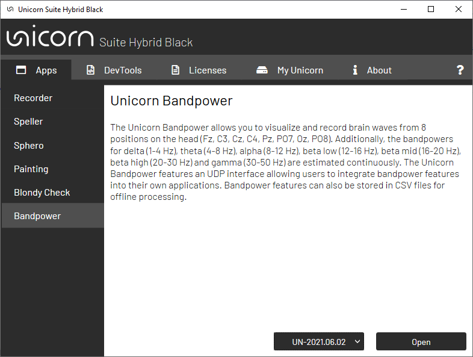

# Unicorn Bandpower Hybrid Black

[Starting Unicorn BandPower From the Unicorn Suite ](#starting-unicorn-bandpower-from-the-unicorn-suite) 

[Status Bar](#status-bar) 

[Control Bar](#control-bar) 

[Main Page](#main-page) 

[Settings](#settings) 

[UDP Interface](#udp-interface) 
    - [UDP Interface Payload Structure](#udp-interface-payload-structure) 

[UDP Bandpower Receiver](#udp-bandpower-receiver) 
    - [Requirements](#requirements) 
    - [Files on your computer](#files-on-your-computer) 
    
[Recordings](#recordings) 

 Unicorn Bandpower Hybrid Black is an application allowing the user to visualize brainwaves from 8 positions on the head. Additionally, the bandpowers for delta (1-4 Hz), theta (4-8 Hz), beta low (12-16 Hz), beta mid (16-20 Hz), beta high (20-30 Hz) and gamma (30-50 Hz) are estimated continuously. The Unicorn Bandpower features an UDP interface allowing users to integrate bandpower features into their own applications. Bandpower features can also be stored in CSV files for offline processing.

 

## Starting Unicorn BandPower From the Unicorn Suite 
The Unicorn Bandpower can be started from the Unicorn Suite. The Unicorn Bandpower is listed in the Unicorn Suite in the “Apps” section. Before you can start Unicorn Bandpower, the application must be unlocked using the license manager. The Unicorn Bandpower is licensed with the same license feature as the Unicorn Recorder. The Unicorn must be paired before using it with Unicorn Bandpower. If the Unicorn is paired, the serial number of the device should be listed in the drop-down box in the Unicorn Suite. Select the serial number and press open, then start the Unicorn Bandpower with the selected device.

 

This dialog is displayed if the connection attempt failed. Make sure that the device is turned on and paired 
before using the Unicorn Bandpower.

 

## Status Bar

 

The following table represents the icons available in the status bar in the upper right corner

 

## Control Bar

 

The following table represents the icons available in the control bar in the upper left corner

 

## Main Page
After connecting to a Unicorn, the user is directed to the main page. The main page features a scope for visualizing and analyzing EEG data. Data in the scope are filtered with a second order Butterworth bandpass filter ranging from 0.5 to 50 Hz. 

 

The signal quality scope provides feedback about the signal quality for each channel. Therefore, the root mean square values of each channel are observed and compared to the thresholds of proper EEG. If an electrode in the signal quality scope turns green, the electrode delivers proper EEG. No action is required. If an electrode in the signal quality scope turns red, the electrode is either floating or flatlined. In both cases, the electrodes do not provide proper EEG. These electrodes should be removed from the data acquisition. You can click on a channel in the signal quality plot to remove it from the data acquisition.

 

The bandpower plot shows the estimated bandpower value for the defined frequency ranges. The defined frequency ranges are delta (1-4 Hz), theta (4-8 Hz), beta low (12-16 Hz), beta mid (16-20 Hz), beta high (20-30 Hz) and gamma (30-50 Hz). The bandpower for each channel is displayed if the “Channels” tab is selected. The average bandpower of all channels is displayed if the “Average” tab is selected. The average bandpower of all possible bipolar derivations of the channels is displayed if the “Bipolar” tab is selected. The update rate of this plot depends on the buffer setting defined in the settings dialog:

 

 

 

## Settings
The Unicorn Bandpower application features a UDP interface. The IP address and port can be modified in the settings dialog. You can also enable or disable the UDP interface in this dialog. 
The sampling rate of the bandpower features depends on the buffer size and buffer overlap configuration. The sampling rate can be determined as follows:

$$ f_{Bandpower} =  { f_{Unicorn} \over buffer size - bufferoverlap} [Hz] $$

By default, the sampling rate of the Unicorn is 250 Hz, the buffer size of the bandpower buffer is 250 samples and the buffer overlap is set to 240 samples. These parameters result in a 25 Hz update rate of the bandpower features.

It is possible to modify the output path for file recordings as well as the filename of the recorded data file. Click the “Reset Defaults” button to restore the default configuration. 

 

## UDP Interface

You can forward bandpower features using an UDP network protocol. The status bar shows the "?" icon if the UDP interface was enabled in the settings dialog. 

 

### UDP Interface Payload Structure
The user will always receive a payload consisting of 70 values structured as described below. Data are sent as a comma separated string in an ASCII format. If channels are disabled in the current data acquisition, the data values are replaced with NaN.

The bandpower feature payload sent via UDP is structured as following:

| 1: delta channel 1                                  | 2: delta channel 2                                  | 3: delta channel 3                                     | 4: delta channel 4                                     | 5: delta channel 5                                      | 6: delta channel 6                                  | 7: delta channel 7          | 8: delta channel 8                                  |
| ------------------------------------------------------ | ------------------------------------------------------ | --------------------------------------------------------- | --------------------------------------------------------- | ---------------------------------------------------------- | ------------------------------------------------------ | ------------------------------ | ------------------------------------------------------ |
| 9: theta channel 1                                  | 10: theta channel 2                                 | 11: theta channel 3                                    | 12: theta channel 4                                    | 13: theta channel 5                                     | 14: theta channel 6                                 | 15: theta channel 7         | 16: theta channel 8                                 |
| 17: alpha channel 1                                 | 18: alpha channel 2                                 | 19: alpha channel 3                                    | 20: alpha channel 4                                    | 21: alpha channel 5                                     | 22: alpha channel 6                                 | 23: alpha channel 7         | 24: alpha channel 8                                 |
| 25: beta low channel 1                              | 26: beta low channel 2                              | 27: beta low channel 3                                 | 28: beta low channel 4                                 | 29: beta low channel 5                                  | 30: beta low channel 6                              | 31: beta low channel 7      | 32: beta low channel 8                              |
| 33: beta mid channel 1                              | 34: beta mid channel 2                              | 35: beta mid channel 3                                 | 36: beta mid channel 4                                 | 37: beta mid channel 5                                  | 38: beta mid channel 6                              | 39: beta mid channel 7      | 40: beta mid channel 8                              |
| 41: beta high channel 1                             | 42: beta high channel 2                             | 43: beta high channel 3                                | 44: beta high channel 4                                | 45: beta high channel 5                                 | 46: beta high channel 6                             | 47: beta high channel 7     | 48: beta high channel 8                             |
| 49: gamma channel 1                                 | 50: gamma channel 2                                 | 51: gamma channel 3                                    | 52: gamma channel 4                                    | 53: gamma channel 5                                     | 54: gamma channel 6                                 | 55: gamma channel 7         | 56: gamma channel 8                                 |
| 57: delta channel 1-8 averaged                         | 58: theta channel 1-8 averaged                         | 59: alpha channel 1-8 averaged                            | 60: beta low channel 1-8 averaged                         | 61: beta mid channel 1-8 averaged                          | 62: beta high channel 1-8 averaged                     | 63: gamma channel 1-8 averaged | 64: delta channel 1-8 bipolar derivations and averaged |
| 65: theta channel 1-8 bipolar derivations and averaged | 66: alpha channel 1-8 bipolar derivations and averaged | 67: beta low channel 1-8 bipolar derivations and averaged | 68: beta mid channel 1-8 bipolar derivations and averaged | 69: beta high channel 1-8 bipolar derivations and averaged | 70: gamma channel 1-8 bipolar derivations and averaged |                                |                                                        |

## UDP Bandpower Receiver

### Requirements
- NET Framework   .NET Framework 4.8
- Visual Studio  Microsoft Visual Studio 2022

### Files on your computer
By default, the Unicorn .NET API library is installed into the Documents folder.
- C:\Users\<username>\Documents\gtec\Unicorn Suite\Hybrid Black\Bandpower\ Bandpower UDP Receiver Standard installation folder for the Unicorn .NET API
library

The Unicorn Bandpower Receiver is an example of how to receive data from the Unicorn Bandpower UDP interface in C#. The application receives data from the Unicorn Bandpower application and prints received data to the console window. Users can create their own applications (e.g. neurofeedback applications) by using the UDP interface to get bandpower features.

## Recordings
During the acquisition, the user can press the record button to start or stop recordings to store data in a csv file. The csv file will always consist of 70 columns representing all 70 bandpower features. If channels are disabled or the feature can’t be evaluated, the values are replaced with NaN. 

The csv columns are structured as following:

| 1: delta channel 1                                  | 2: delta channel 2                                  | 3: delta channel 3                                     | 4: delta channel 4                                     | 5: delta channel 5                                      | 6: delta channel 6                                  | 7: delta channel 7          | 8: delta channel 8                                  |
| ------------------------------------------------------ | ------------------------------------------------------ | --------------------------------------------------------- | --------------------------------------------------------- | ---------------------------------------------------------- | ------------------------------------------------------ | ------------------------------ | ------------------------------------------------------ |
| 9: theta channel 1                                  | 10: theta channel 2                                 | 11: theta channel 3                                    | 12: theta channel 4                                    | 13: theta channel 5                                     | 14: theta channel 6                                 | 15: theta channel 7         | 16: theta channel 8                                 |
| 17: alpha channel 1                                 | 18: alpha channel 2                                 | 19: alpha channel 3                                    | 20: alpha channel 4                                    | 21: alpha channel 5                                     | 22: alpha channel 6                                 | 23: alpha channel 7         | 24: alpha channel 8                                 |
| 25: beta low channel 1                              | 26: beta low channel 2                              | 27: beta low channel 3                                 | 28: beta low channel 4                                 | 29: beta low channel 5                                  | 30: beta low channel 6                              | 31: beta low channel 7      | 32: beta low channel 8                              |
| 33: beta mid channel 1                              | 34: beta mid channel 2                              | 35: beta mid channel 3                                 | 36: beta mid channel 4                                 | 37: beta mid channel 5                                  | 38: beta mid channel 6                              | 39: beta mid channel 7      | 40: beta mid channel 8                              |
| 41: beta high channel 1                             | 42: beta high channel 2                             | 43: beta high channel 3                                | 44: beta high channel 4                                | 45: beta high channel 5                                 | 46: beta high channel 6                             | 47: beta high channel 7     | 48: beta high channel 8                             |
| 49: gamma channel 1                                 | 50: gamma channel 2                                 | 51: gamma channel 3                                    | 52: gamma channel 4                                    | 53: gamma channel 5                                     | 54: gamma channel 6                                 | 55: gamma channel 7         | 56: gamma channel 8                                 |
| 57: delta channel 1-8 averaged                         | 58: theta channel 1-8 averaged                         | 59: alpha channel 1-8 averaged                            | 60: beta low channel 1-8 averaged                         | 61: beta mid channel 1-8 averaged                          | 62: beta high channel 1-8 averaged                     | 63: gamma channel 1-8 averaged | 64: delta channel 1-8 bipolar derivations and averaged |
| 65: theta channel 1-8 bipolar derivations and averaged | 66: alpha channel 1-8 bipolar derivations and averaged | 67: beta low channel 1-8 bipolar derivations and averaged | 68: beta mid channel 1-8 bipolar derivations and averaged | 69: beta high channel 1-8 bipolar derivations and averaged | 70: gamma channel 1-8 bipolar derivations and averaged |                                |                                                        |

 

The update rate of the bandpower features depends on the buffer size and buffer overlap configuration as described in [Settings](#settings)